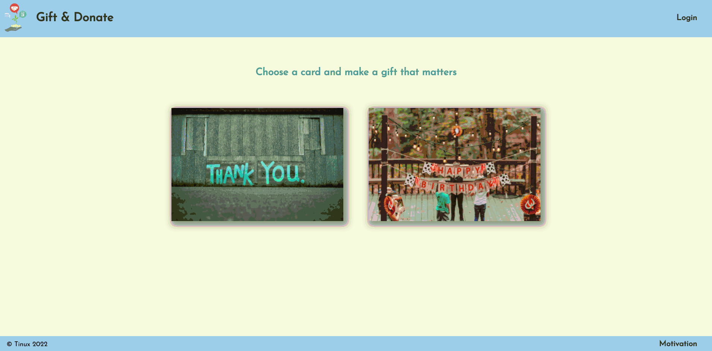
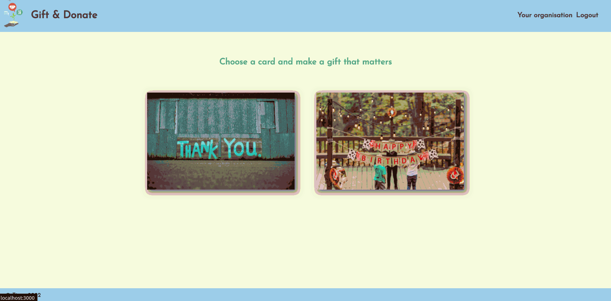
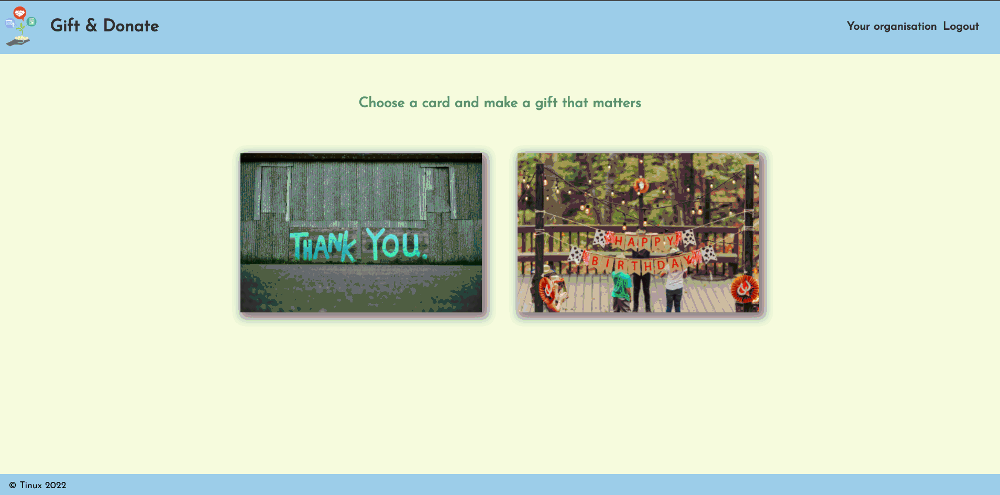

# Give and Donate

## Overview

Give and Donate (GnD) is a platform for buying donations, which hopes to turn into a small social enterprise in the near future.

Giving someone a gift is an act of care and compassion essential in our society. However, the making of physical gifts comes with a significant cost to our environment. When it’s not the right gift, returning, stacking it away and even worse disposing of it increases this cost exponentially.

We do not want to do away with gift giving, that is awesome, we just want to reduce its footprint while maintaining its magic. Thus, the idea of Give and Donate was born.

Our platform allows you to make a donation in the name of someone you care about and send them a gift card. You could donate to a cause close to their heart or that you, personally, care about.

This donation would help a small association in Romania do something good at the grass root level. From their perspective, GnD is another source of income they can easily access. And this is an important feature for us.

GnD’s goals are: very easy registration and administration for the NGOs and great design for the gift-givers.

## Notes

-   I haven't tried the instructions for running locally (will do soon) so please reach out if you get stuck
-   The project is still in development phase

## Tried it yourself locally

**Requirements**: git, node, npm, postgreSQL, redis

1. Clone the repo
2. Set-up your secrets.json file based on the
   [provided example](https://github.com/Tinux-18/GnD/blob/main/secrets_example.json)
3. Set-up your database with `createdb <database_name>`
4. Create the tables from
   [setup.sql](https://github.com/Tinux-18/GnD/blob/main/server/sql/setup.sql)
5. Install npm packages with `npm i`
6. Start the client with `npm run dev:client`
7. Start Redis with `redis-server --daemonize yes`
8. Start the server with `npm start`

## Techstack

This was my graduation project from the Spiced Academy full-stack web development bootcamp.

I am to develop this project further and go live sometime in 2022.

### Front-end

&nbsp;&nbsp;&nbsp;

### Back-end

&nbsp;&nbsp;&nbsp;

&nbsp;&nbsp;&nbsp;

## Features

**User registration**

-   forms for login, registration and password reset
-   client side form validation
-   password reset using AWS SES
-   separate user profiles for shoppers and NGO admins

**Gift shopping**

-   purchase a card
-   select from existing list of organisations

**NGO registration**

-   3-part registration form
-   file upload
-   pre-population of fields upon returning to page even from a different machine

**NGO dashboard**

-   overview of donations
-   approve donations over €300

## Todo

**General**

-   fix vulnerability issues / productionalize
-   add terms and conditions
-   refactor UI
-   bring test coverage above 70%
-   deploy to Heroku

**Registration**

-   add more input constraints
-   integrate registration with Google, Facebook
-   stylise email sent for password reset

**NGO registration**

-   fix redirect after file upload
-   add donation treshold (above which approval is needed)

**Purchase**

-   send email after purchase to gift receiver with card and custom message
-   add more input constraints
-   integrate paypal donation
-   develop legal and financial processes

**NGO dashboard**

-   add column for donation sender
-   add email notification for NGO
-   enable multiple administrators

**Validation**

-   send email to our admins for confirmation containing all information about orgnisation
-   our admins should click one link to confirm
